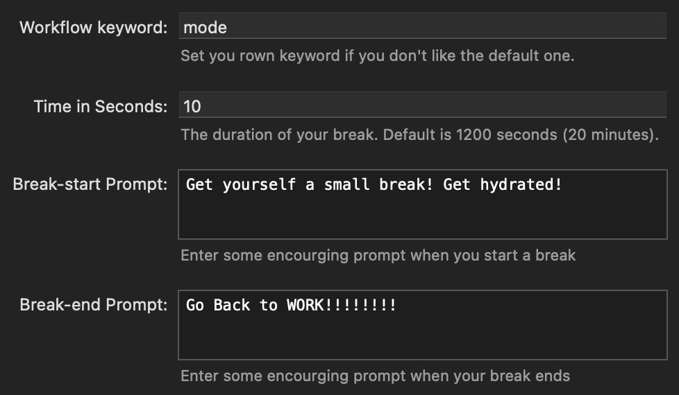

# Mode

	

<b><i>
	Launch a set of apps under different scenarios.
</i></b>

## Abstract

Open different Apps and turn Focus on/off based on what I'm doing. Use `mode work/break/rest` to toggle between different modes. To download the workflow, see the [release page](https://github.com/sleepymalc/mode/releases).

## Available Modes

There are three modes:

### Work

Bring all relevant apps and close others, and turn on Work Focus.

### Break

Close work-apps, open entertaining-apps, turn off Work Focus.
> The default break time is 20 minutes, after that it'll **bring you back to Work mode**.

### Rest

Basically a no time-limit version of [Break](#break).

## Settings

You **need** to create two very simple [Shortcuts](https://support.apple.com/guide/shortcuts-mac/intro-to-shortcuts-apdf22b0444c/mac) by using `Set Focus`:

1. WorkOn

	

2. WorkOff

	

## Customize

### Launched Apps

To customize the launched apps you want to launch in different modes, you simply change the **Launch Apps list** in each mode flow line. Quite self-explanatory.

### Else

You can also customize the followings in `Configure Workflow`:

1. Break time: Note that it's in seconds.
2. Prompt when the break starts/ends: Say something nice to yourself!!
3. Keywords: You can use different keywords if you don't like the default `mode`.

	

## Known Issues

### Chrome Windows Management

I have two `Google Chrome` instances opened all the time with different profiles. Sadly, there's no *stable* way to change your current focus to the desired one while hiding another. Firstly, when hiding a particular windows, macOS just help you hide **all** the windows of that app. Even worse, open a particular profile with command line (`open -a 'Google Chrome' --args --profile-directory="default"`) doesn't work properly neither: it'll just bring all the chrome windows to the front. And even worse, it won't even put your focus on a particular profile. But I find out that by putting a particular windows to the **full-screen** mode, one can hide a non full-screen window individually, which may help. But for now, I can't find a neat way to do it properly.

### First Launch

You might notice that when you first launch this workflow, a notification indicates that ther's a bug is **expected**: Since I create a variable file to keep track of the mode you're now in, and if you haven't manually create it, it can't find that file hence fail to read anything. But don't worry, if the file do not exist, macOS will create for you automatically, so after the frist launch, everything should be fine and work properly.

