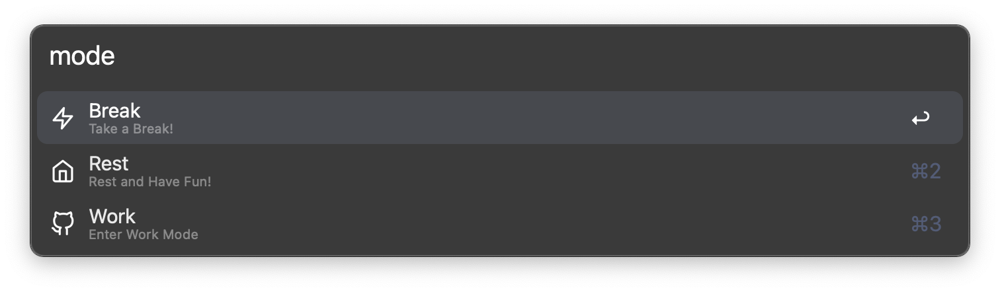
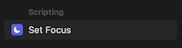

# Mode

	

<b><i>
	Launch a set of apps under different scenarios.
</i></b>

## Abstract

Open different folders and turn Focus on/off based on what I'm doing. Use `mode work/break/rest` to toggle between different modes.

## Available Modes

There are three modes:

### Work

Bring all relevant apps and close others, and turn on Work Focus.

### Break

Close work-apps, open entertaining-apps, turn off Work Focus.
> The default break time is 20 minutes, after that it'll **bring you back to Work mode**.

### Rest

Basically a no time-limit version of [Break](#break).

## Customize

### Launched Apps

To customize the launched apps you want to launch in different modes, you simply change the **Launch Apps list** in each mode flow line. Quite self-explanatory.

### Break Time

To customize the break time, you can click the `Configure Workflow` and change the time there. (note that it's in seconds)

### Prompts

To customize the prompt when the break starts/ends, you can also customize them in `Configure Workflow`.

### Keywords

To use your own keywords instead of the default `mode`, you can also change it in the `Configure Workflow` window.

## Settings

You **need** to create two very simple [Shortcuts](https://support.apple.com/guide/shortcuts-mac/intro-to-shortcuts-apdf22b0444c/mac) by using `Set Focus`

	

1. WorkOn

	

2. WorkOff

	

## Known Issues

macOS doesn't like full-screen mode, at least in some degrees. I have `Google Chrome` opened all the time in full-screen mode, and there's no *stable* way to change your current focus to that opened full-screen chrome instance. I have tried to do this by using both command line (`open -a /Applications/Google\ Chrome.app` and 'open -a 'Google') and [Shortcuts](https://support.apple.com/guide/shortcuts-mac/intro-to-shortcuts-apdf22b0444c/mac), but none of them works. It seems to be a macOS issue, but I think maybe they'll fix it within [Shortcuts](https://support.apple.com/guide/shortcuts-mac/intro-to-shortcuts-apdf22b0444c/mac), so I just leave it (the `Open Chrome` [Shortcuts](https://support.apple.com/guide/shortcuts-mac/intro-to-shortcuts-apdf22b0444c/mac) in the workflow at the very end) there though they currently do nothing.

If you don't use full-screen mode, add Chrome into your **Launch Apps list** is enough.
